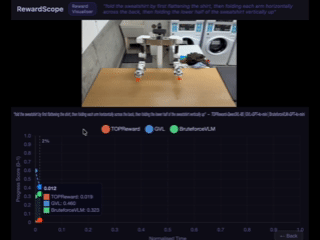

# RewardScope 🎛️ #
## A web tool to compare popular robot reward functions on your own manipulation videos. ##



Reward functions you can run on your videos:
- **[TOPReward](https://topreward.github.io/webpage/)** — from *TOPReward: Token Probabilities as Hidden Zero-Shot Rewards for Robotics* by [@jcoleharrison](https://github.com/jcoleharrison) , [@chinsengi](https://github.com/chinsengi) , UW
- **[Robometer](https://robometer.github.io/)** - from *Robometer: Scaling General-Purpose Robotic Reward Models via Trajectory Comparisons* by [@ygtkorkmaz](https://github.com/ygtkorkmaz) , [@aliang8](https://github.com/aliang8) , USC
- **[RoboReward](https://arxiv.org/abs/2601.00675)** — from *RoboReward: General-Purpose Vision-Language Reward Model for Robotics* by [@teetone](https://github.com/teetone), [@ajwagenmaker](https://github.com/ajwagenmaker), [@kpertsch](https://github.com/kpertsch), Stanford & Berkeley 
- **[Generative Value Learning (GVL)](https://arxiv.org/pdf/2411.04549)** — from *Vision Language Models are In-Context Value Learners*, Google DeepMind
- **Brute Force** — at each frame, sends the video up to that point to the VLM and asks for a progress score between 0.0 and 1.0

...and easy to add more!

# How to run on your own videos #

1. Create an MP4 video of robot manipulation.
    (Downsize it to 480p if possible, as image pixels are passed as tokens)

2. Run the steps in the *Installation* section. 

3. Run reward algorithms on your video:

    A. **Run `topreward`, `roboreward`, `gvl`, and/or `bruteforce_vlm`**

     Run the script to calculate reward functions on your video:

     ```
     python run_rewards.py --video myvideo.mp4 --instruction "create a tower of 5 cubes"
     ```

     If you have an OpenAI API key, add the flags `--openai-api-key <your key>` and `--method topreward,roboreward,gvl,bruteforce_vlm`.

     If you don't have an OpenAI API key, add the flag `--method topreward,roboreward`.

     * Note on Memory: For `topreward`, you are downloading ~15GB in model weights.  For `roboreward`, you are downloading ~17GB in model weights.  You'll need ~16GB+ unified/GPU mem to run either.

    B. **Run `robometer`**

     Compute the robometer reward on the same video file [here](https://github.com/philfung/robometer?tab=readme-ov-file#usage).


5. View the results in your browser:
   ```
   ./run_viewer.sh
   ```

## Installation

### 1. Install Python packages
```
virtualenv venv
. venv/bin/activate
pip install -r requirements.txt
pip install torch torchvision transformers accelerate qwen-vl-utils
```

### 2. Get an OpenAI API key (optional)
Create an [OpenAI API key](https://platform.openai.com/api-keys).

This is used for running GVL and Brute Force.
